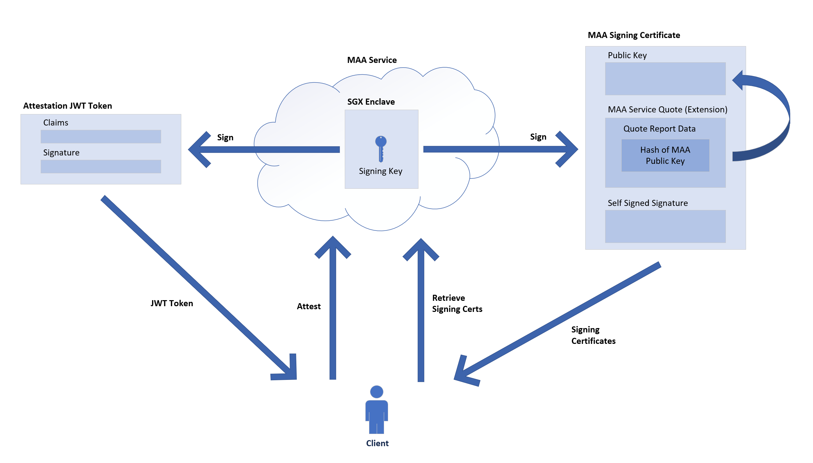

---
page_type: sample
languages:
- c
- csharp
products:
  - azure
description: "Learn how to perform Intel® SGX Attestation using Microsoft Azure Attestation"
--- 

# Sample code for Intel® SGX Attestation using Microsoft Azure Attestation

Intel® SGX Attestation sample code demonstrates how to generate a quote from an SGX enclave using Open Enclave SDK and then get it validated by Microsoft Azure Attestation. The "enclave held data" for the quote is populated with public key component of a 2048 bit RSA key that's held within the enclave.

The components used in the sample code are outlined in the following diagram:


The flow is:
1. ```genquote_host``` - This application is run first and performs the following:
    1. Launches the ```genquote_enclave``` SGX enclave
    1. Calls into the enclave (via an ecall) to retrieve a remote quote and a copy of the enclave held data, which in this case is the public key for a 2048 bit RSA key
    1. Calls into the Open Enclave SDK to parse the remote quote to retrieve important attributes like Security Version Number, ProductID, MRSIGNER, MRENCLAVE, etc.
    1. Persists the remote quote, enclave held data and parsed report fields to a JSON file on disk
1. ```genquote_enclave``` - This application is an SGX enclave created via the Open Enclave SDK.  It exposes one ecall to retrieve a remote quote and enclave held data.
1. ```validatequotes.core``` - This application is built on .NET core and runs on any platform.  It consumes the JSON file persisted by the ```genquote_host``` application and performs the following:
    1. Calls the Azure Attestation for validation, passing it the remote quote and enclave held data found in the JSON file
    1. Validates that the Azure Attestation JWT passes signature validation and is issued by the expected party
    1. Validates that the Azure Attestation JWT claim values match the parsed data in the JSON file for the well known fields like Security Version Number, ProductID, MRSIGNER, MRENCLAVE, etc.
    1. Produces a report in the console with the results
1. ```validatequotes.net``` - This application is build on the .NET framework and only runs on Windows.  It performs all the validation performed by ```validatequotes.core``` and additionally validates the Azure Attestation SGX quote embedded in its signing certificate using the Open Enclave SDK locally.  The additional steps are:
    1. Checks for the presence of an SGX quote for the Azure Attestation itself as an extension in the Azure Attestation X.509 signing certificate.
    1. Verifies the SGX quote with the Open Enclve SDK's ```oe_verify_remote_report``` API.
    1. Verifies that the hash of the public key that signed the JWT token matches the report data in the verified quote.

The following diagram depicts the relationship between the different artifacts produced the Azure Attestation for JWT token validation.


